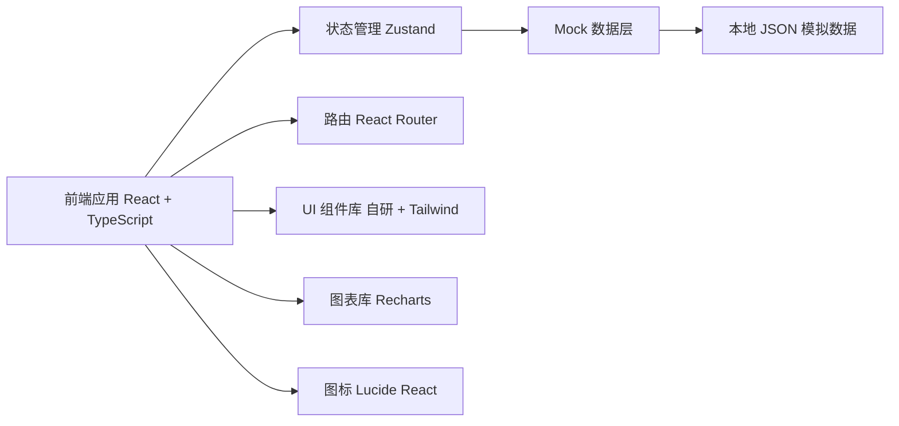

## 1. 架构设计



## 2. 技术描述

- 前端：React@18 + TypeScript + Vite
- 初始化工具：vite-init react-ts 模板
- 样式：TailwindCSS@3
- 状态管理：Zustand
- 路由：react-router-dom@6
- 图表：Recharts
- 图标：lucide-react
- 后端：无（纯前端 Mock 数据实现）
- 数据：本地 Mock 数据 + localStorage 持久化

## 3. 路由定义

| 路由 | 页面 | 说明 |
|------|------|------|
| / | 风险总览 | 默认首页，数据看板 |
| /alerts | 预警列表 | 预警筛选和列表展示 |
| /cases/:id | 案件详情 | 单个案件处置页面 |
| /strategy | 策略调参 | 阈值配置和黑白名单 |
| /reports | 报表中心 | 风险报告查看和导出 |

## 4. 数据模型

### 4.1 核心数据类型

```typescript
// 风险等级
type RiskLevel = 'low' | 'medium' | 'high' | 'critical';

// 预警状态
type AlertStatus = 'pending' | 'processing' | 'resolved' | 'false_positive';

// 处置类型
type DispositionType = 'approve' | 'reject' | 'freeze' | 'escalate';

// 预警信息
interface Alert {
  id: string;
  merchantId: string;
  merchantName: string;
  transactionId: string;
  amount: number;
  currency: string;
  region: string;
  riskScore: number;
  riskLevel: RiskLevel;
  hitRules: HitRule[];
  status: AlertStatus;
  createdAt: string;
  assignee?: string;
  similarityGroup?: string;
}

// 命中规则
interface HitRule {
  ruleId: string;
  ruleName: string;
  severity: RiskLevel;
  description: string;
}

// 案件信息
interface Case extends Alert {
  verifyRecords: VerifyRecord[];
  disposition?: Disposition;
  operationLogs: OperationLog[];
}

// 电话核实记录
interface VerifyRecord {
  id: string;
  contactPerson: string;
  phone: string;
  content: string;
  result: 'confirmed' | 'denied' | 'unreachable';
  operator: string;
  createdAt: string;
}

// 处置结论
interface Disposition {
  type: DispositionType;
  remark: string;
  operator: string;
  createdAt: string;
}

// 操作留痕
interface OperationLog {
  id: string;
  action: string;
  detail: string;
  operator: string;
  createdAt: string;
}

// 风控规则
interface RiskRule {
  id: string;
  name: string;
  description: string;
  currentThreshold: number;
  minThreshold: number;
  maxThreshold: number;
  unit: string;
  enabled: boolean;
  hitCount: number;
  falsePositiveCount: number;
}

// 黑白名单
interface BlackWhiteList {
  id: string;
  type: 'black' | 'white';
  category: 'merchant' | 'ip' | 'card';
  value: string;
  reason: string;
  createdAt: string;
  operator: string;
}

// 报表
interface Report {
  id: string;
  type: 'daily' | 'weekly';
  period: string;
  generatedAt: string;
  summary: ReportSummary;
}

interface ReportSummary {
  totalAlerts: number;
  confirmedRisks: number;
  falsePositives: number;
  interceptedAmount: number;
  riskDistribution: Record<RiskLevel, number>;
}
```

### 4.2 状态管理结构

```typescript
interface AppState {
  alerts: Alert[];
  cases: Case[];
  rules: RiskRule[];
  lists: BlackWhiteList[];
  reports: Report[];
  currentUser: User;
  filters: AlertFilters;
}
```

## 5. 项目目录结构

```
src/
├── components/          # 通用组件
│   ├── Layout/          # 布局组件
│   ├── charts/          # 图表组件
│   ├── common/          # 通用UI组件
│   └── tables/          # 表格组件
├── pages/               # 页面
│   ├── Dashboard.tsx    # 风险总览
│   ├── AlertList.tsx    # 预警列表
│   ├── CaseDetail.tsx   # 案件详情
│   ├── Strategy.tsx     # 策略调参
│   └── Reports.tsx      # 报表中心
├── store/               # Zustand状态
│   └── useAppStore.ts
├── data/                # Mock数据
│   └── mockData.ts
├── utils/               # 工具函数
│   └── formatters.ts
├── types/               # 类型定义
│   └── index.ts
├── App.tsx
├── main.tsx
└── index.css
```
