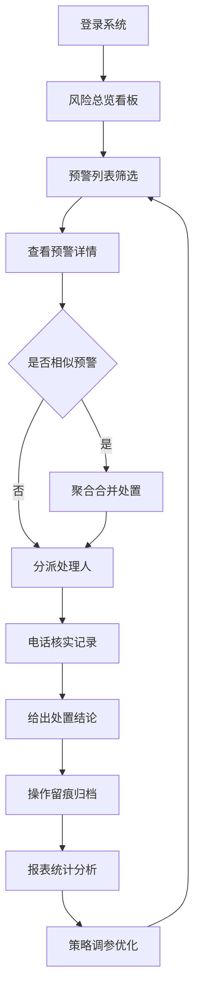

## 1. 产品概述

金融风控 Web 应用，供支付机构风控专员日常值班和复核使用，实现商户交易异常监控、预警处置、策略优化和风险报告全流程管理。

- 核心目标：提升风控处置效率，降低交易欺诈损失，辅助策略持续优化
- 目标用户：风控专员、风控主管、策略分析师

## 2. 核心功能

### 2.1 用户角色

| 角色 | 登录方式 | 核心权限 |
|------|----------|----------|
| 风控专员 | 账号登录 | 查看预警、处置案件、标记误报、电话核实记录 |
| 风控主管 | 账号登录 | 分派案件、查看所有案件、审批处置结论 |
| 策略分析师 | 账号登录 | 策略调参、阈值模拟、黑白名单维护、查看报表 |

### 2.2 功能模块

1. **风险总览**：实时风险指标看板、趋势图表、区域热力分布、高危商户 TOP 榜
2. **预警列表**：多维度筛选、相似预警聚合、风险评分展示、批量操作
3. **案件详情**：案件信息全景、处理人分派、电话核实记录、处置结论、操作留痕时间线
4. **策略调参**：阈值配置、模拟影响分析、黑白名单管理、误报标记回溯
5. **报表中心**：日报/周报生成、多维度统计、报表导出

### 2.3 页面详情

| 页面名称 | 模块名称 | 功能描述 |
|----------|----------|----------|
| 风险总览 | 核心指标卡片 | 今日预警数、待处置数、已确认风险、拦截金额 |
| 风险总览 | 趋势图表 | 近7/30天预警量趋势、风险等级分布 |
| 风险总览 | 区域分布 | 各地区风险交易热力分布 |
| 风险总览 | 高危商户榜 | TOP10 高风险商户列表 |
| 预警列表 | 高级筛选 | 按商户、金额区间、地区、时间范围、风险等级筛选 |
| 预警列表 | 预警列表 | 展示风险评分、命中规则、交易信息、状态标签 |
| 预警列表 | 相似聚合 | 自动聚合同商户/同类型预警，支持合并处置 |
| 预警列表 | 批量操作 | 批量分派、批量标记误报、批量导出 |
| 案件详情 | 案件概览 | 案件基本信息、关联交易、风险评分雷达图 |
| 案件详情 | 分派处理 | 选择处理人、设置优先级、备注说明 |
| 案件详情 | 电话核实 | 核实记录表单（联系人、电话、核实内容、结果） |
| 案件详情 | 处置结论 | 选择处置类型（放行/拦截/冻结/升级）、填写结论说明 |
| 案件详情 | 操作留痕 | 完整时间线展示所有操作记录和操作人 |
| 策略调参 | 规则列表 | 风控规则列表、当前阈值、启停状态 |
| 策略调参 | 阈值模拟 | 调整阈值、查看历史数据模拟命中变化量 |
| 策略调参 | 黑白名单 | 商户/IP/卡号黑白名单增删改查 |
| 策略调参 | 误报管理 | 误报标记列表、规则命中率统计、误报原因分析 |
| 报表中心 | 报表列表 | 日报、周报历史列表 |
| 报表中心 | 报表预览 | 在线查看报表内容、图表展示 |
| 报表中心 | 报表导出 | 导出 PDF/Excel 格式报告 |

## 3. 核心流程

风控专员登录系统后，先在风险总览查看整体态势，进入预警列表筛选待处置预警，选择预警进入案件详情，完成电话核实并记录，给出处置结论，策略分析师定期查看报表并进行策略调参和阈值优化。

## 4. 用户界面设计

### 4.1 设计风格

- 主色调：深邃藏蓝 `#0B1929` 作为主背景，科技感青蓝 `#00D4FF` 作为主强调色，警戒红 `#FF4D4F`、预警橙 `#FA8C16`、安全绿 `#52C41A` 作为风险等级标识色
- 辅助色：中性灰 `#1F2937`、`#374151` 用于卡片和边框
- 按钮样式：圆角 6px，强调色按钮带微发光效果，悬停时有亮度提升
- 字体：主字体使用 IBM Plex Mono（等宽数字）+ Noto Sans SC（中文），数据展示强调等宽字体
- 布局：左侧固定导航 + 顶部状态栏 + 主内容区卡片式布局，数据密集型展示
- 图标风格：lucide-react 线性图标，配合数据状态色彩

### 4.2 页面设计概览

| 页面名称 | 模块名称 | UI 元素 |
|----------|----------|----------|
| 风险总览 | 核心指标卡片 | 深色渐变卡片、发光数据、趋势小图、动画数字滚动 |
| 风险总览 | 趋势图表 | 面积图、环形图、深色网格背景 |
| 预警列表 | 筛选栏 | 下拉选择器、日期范围、滑块筛选、紧凑布局 |
| 预警列表 | 数据表格 | 斑马纹行、风险等级色标、评分进度条、悬浮高亮 |
| 案件详情 | 时间线 | 垂直时间轴、节点圆点、操作人头像、淡入动画 |
| 策略调参 | 滑块调参 | 阈值滑块、实时数值、模拟对比柱状图 |
| 报表中心 | 报表卡片 | 报告封面缩略、下载按钮、生成时间 |

### 4.3 响应式设计

- 桌面端优先设计（1440px+），适配风控专员多屏工作场景
- 侧边栏可折叠，内容区最小宽度 1024px
- 表格支持横向滚动，筛选栏在小屏自动换行

### 4.4 动效设计

- 页面切换：淡入 + 轻微上移动画
- 数据更新：数字滚动动画、卡片发光脉冲
- 交互反馈：按钮悬停亮度提升、表格行悬浮背景变化
- 风险告警：高风险预警条目呼吸灯效果
